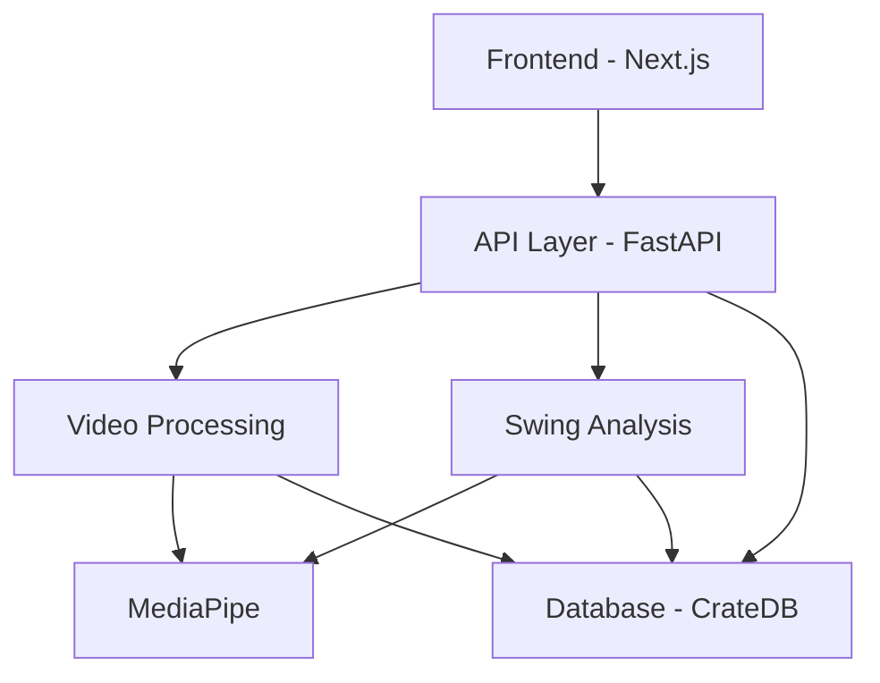

# SwingVision Architecture

## System Overview

## Components

### Frontend (Next.js)
- Single Page Application
- Responsive design
- Real-time feedback display
- Interactive video analysis interface

### API Layer (FastAPI)
- RESTful endpoints
- Asynchronous processing
- WebSocket support for real-time updates
- Authentication and authorization

### Video Processing
- Frame extraction
- Video compression
- Key frame detection
- Pose estimation preprocessing

### Swing Analysis
- Pose estimation using MediaPipe
- Swing metrics calculation
- Pattern recognition
- Feedback generation

### Database (CrateDB)
- Multi-model data storage
- Vector data for pose analysis
- Time series for progress tracking
- BLOB storage for video data

## Data Flow

1. Video Upload
   - User uploads swing video
   - Video is validated and preprocessed
   - Stored in temporary storage

2. Analysis Pipeline
   - Frame extraction
   - Pose estimation
   - Metrics calculation
   - Results storage

3. Feedback Generation
   - Pattern matching
   - Recommendations generation
   - Progress comparison
   - Report generation

## Security Considerations

- Authentication using JWT
- HTTPS for all communications
- Input validation
- Rate limiting
- Data encryption at rest

## Scalability

- Horizontal scaling of API servers
- Distributed CrateDB cluster
- CDN for static assets
- Queue-based video processing

## Monitoring

- OpenTelemetry integration
- Grafana dashboards
- Error tracking
- Performance metrics
