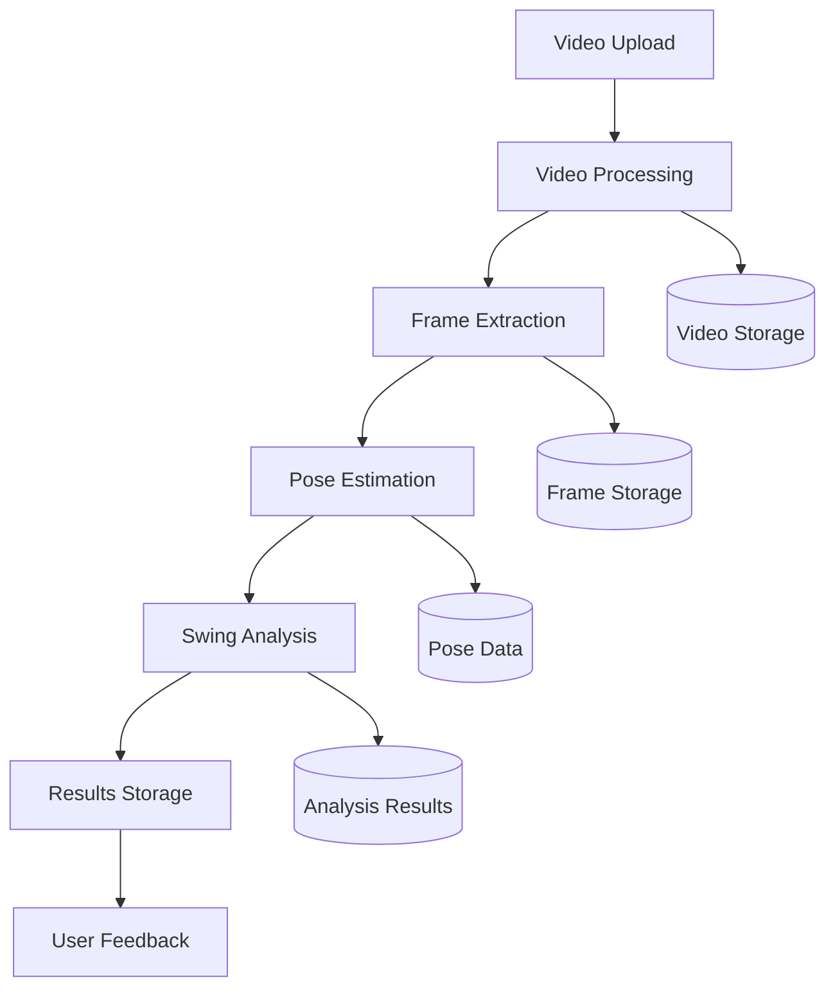

# Data Architecture

## Overview
SwingVision's data architecture is designed to handle various types of data efficiently, from video processing to analytics storage. The system uses CrateDB's multi-model capabilities to optimize different data access patterns.

## Data Flow

## Data Types and Storage

### Video Data
- Raw video files stored as BLOBs
- Video metadata in structured format
- Processed frames cached for quick access
- Temporary storage for processing pipeline

### Pose Data
- 3D landmark coordinates
- Confidence scores
- Vector representations for similarity search
- Temporal sequence data

### Analysis Data
- Swing metrics and measurements
- Temporal alignment data
- Comparison results
- Performance indicators

### User Data
- Profile information
- Progress tracking
- Preferences and settings
- Training history

## Data Processing Pipeline

1. **Video Ingestion**
   - Format validation
   - Metadata extraction
   - Initial quality checks
   - Temporary storage allocation

2. **Frame Processing**
   - Frame extraction
   - Quality enhancement
   - Key frame detection
   - Pose estimation preparation

3. **Analysis Pipeline**
   - Pose estimation
   - Metrics calculation
   - Pattern recognition
   - Feedback generation

4. **Results Processing**
   - Data aggregation
   - Metric normalization
   - Insight generation
   - Report compilation

## Storage Optimization

### Hot Data
- Recent swing analyses
- Active user data
- Frequently accessed metrics
- Cache layer implementation

### Warm Data
- Historical swing data
- Training progress
- Performance trends
- Aggregated analytics

### Cold Data
- Archive videos
- Old analysis results
- Inactive user data
- System backups

## Data Access Patterns

### Batch Processing
- Historical analysis
- Trend calculation
- Model training
- System maintenance

### Analytics
- Performance metrics
- User progress
- System usage
- Quality metrics

## Data Security

### Authentication
- User authentication
- API access control
- Service authentication
- Token management

### Authorization
- Role-based access
- Resource permissions
- Data ownership
- Access auditing

### Encryption
- Data in transit
- Data at rest
- Key management
- Secure backups

## Backup and Recovery

### Backup Strategy
- Regular snapshots
- Incremental backups
- Cross-region replication
- Point-in-time recovery

### Recovery Procedures
- Data restoration
- System recovery
- Disaster recovery
- Backup validation

## Monitoring and Maintenance

### Performance Monitoring
- Query performance
- Storage utilization
- Access patterns
- System metrics

### Data Quality
- Validation checks
- Integrity monitoring
- Error detection
- Quality metrics

### Maintenance
- Data cleanup
- Index optimization
- Storage optimization
- System updates
